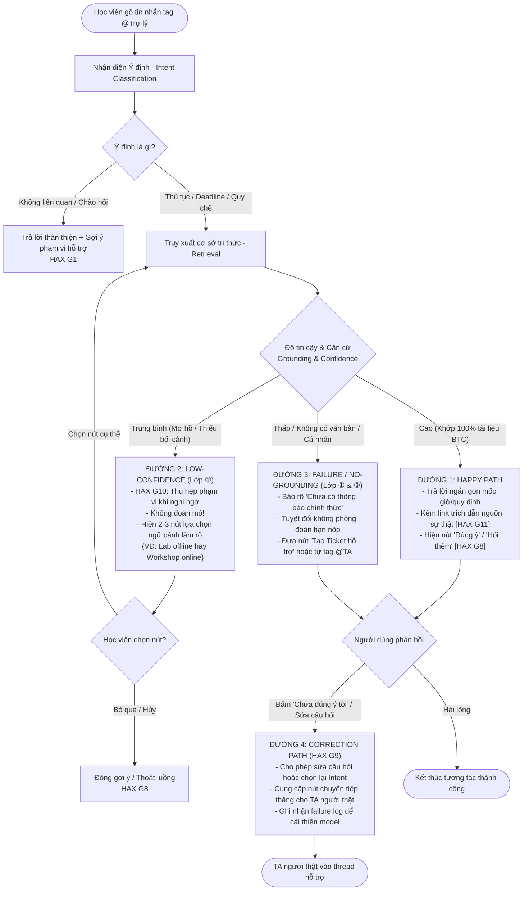

# SƠ ĐỒ LUỒNG TRẢI NGHIỆM NGƯỜI DÙNG & RA QUYẾT ĐỊNH AI (CP2)
**Dự án:** Trợ lý Discord K4 — Track B1 (Tối ưu Trợ lý hiện có)  
**Lát cắt MỘT CÂU:** *Học viên gõ câu hỏi deadline/thủ tục trên Discord · cần biết thông tin chính xác · AI quyết định câu hỏi có khớp nguồn chính thức không (có: trả lời kèm link trích dẫn; không: từ chối và tag TA/mở ticket) · học viên nhận thông tin chuẩn xác.*

---

## 1. Sơ đồ Luồng Tổng Thể (System & User Journey Flowchart)

---

## 2. Mô Tả Chi Tiết 4 Đường Đi Của Trải Nghiệm (spec.md §6)

### 🟢 1. Happy Path (Tự tin cao — High Confidence)
- **Kịch bản:** Học viên hỏi: *"Hạn nộp bài Lab02 là mấy giờ?"*
- **Quyết định AI:** Khớp chính xác tài liệu thông báo của BTC (Rule `LAB02_DEADLINE`). Độ tin cậy = $1.0$.
- **Phản hồi hệ thống:** Trả lời trực tiếp: *"Hạn nộp Lab02 là 23:59 ngày 18/09/2026."* kèm link trích dẫn `[Kênh #📢-thông-báo]`. 
- **Nguyên tắc HAX:** **G11** (Giải thích vì sao và dẫn nguồn kiểm chứng).

### 🟡 2. Low-Confidence Path (Mơ hồ / Thiếu thông tin — Lớp chỗ khó ②)
- **Kịch bản:** Học viên hỏi: *"Điểm danh thế nào ạ?"* (không nói rõ là điểm danh buổi Lab offline hay Workshop Zoom buổi tối).
- **Quyết định AI:** Độ tin cậy trung bình, phát hiện có 2 quy trình điểm danh khác nhau.
- **Phản hồi hệ thống:** Áp dụng **HAX G10 (Thu hẹp phạm vi khi nghi ngờ)** — Bot **không đoán mò**, trả lời: *"Bạn đang cần xem quy chế điểm danh cho hoạt động nào?"* và đưa ra 2 nút bấm: `[1. Lab offline trên lớp]` và `[2. Workshop Zoom buổi tối]`.
- **Hành động người dùng:** Bấm chọn 1 trong 2 để nhận ngay câu trả lời chính xác tương ứng.

### 🔴 3. Failure / No-Grounding Path (Không có căn cứ / Ngoài thẩm quyền — Lớp chỗ khó ① & ③)
- **Kịch bản:** Học viên hỏi: *"Check xem tớ đã nộp bài codelab chưa"* (câu hỏi dữ liệu cá nhân) HOẶC *"Cho em nộp muộn lab 2 được không"* (vấn đề ngoài thẩm quyền bot).
- **Quyết định AI:** Xác định đây là câu hỏi ngoài thẩm quyền (chỗ khó ③) hoặc không có dữ liệu tra cứu cá nhân.
- **Phản hồi hệ thống:** Bot trung thực: *"Mình không có thẩm quyền duyệt gia hạn hoặc kiểm tra bài nộp cá nhân của bạn."* Kèm nút bấm: `[Tạo Ticket hỗ trợ /ticket]` hoặc tự động tag `@TA_Support` vào thread để hỗ trợ.

### 🔄 4. Correction Path (Người dùng sửa trực tiếp kết quả — HAX G9)
- **Kịch bản:** Học viên thấy bot trả lời chưa đúng vấn đề họ quan tâm.
- **Tương tác:** Học viên bấm nút `[Chưa đúng ý tôi]`.
- **Phản hồi hệ thống:** Bot thu hồi câu trả lời, hiển thị menu nhanh: `[Xem danh mục quy chế]` / `[Gõ lại câu hỏi]` / `[Chuyển cho TA]`. Khi bấm `[Chuyển cho TA]`, bot tự động chuyển câu hỏi vào kênh trực nhật của TA kèm tóm tắt ngữ cảnh.
